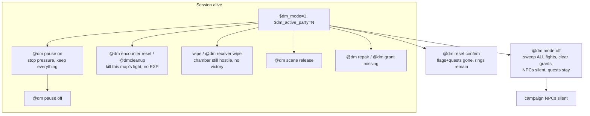
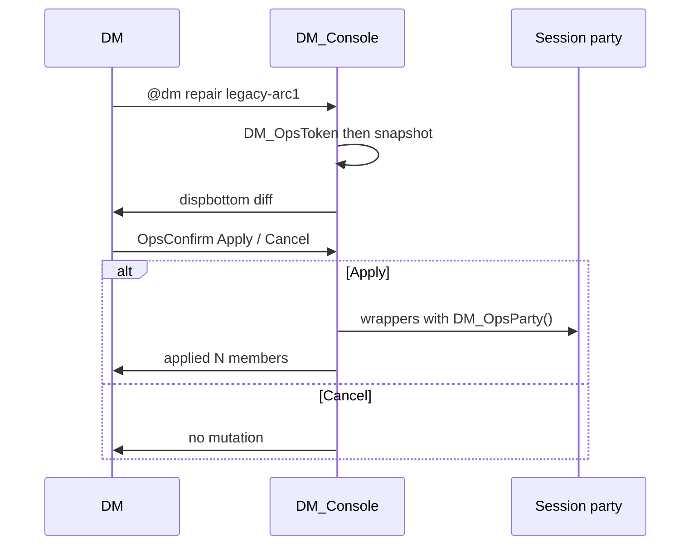

# Seal Cascade — DM Table Operations

**Author:** (handoff; implementer was not in the Act I rewrite)  
**Date:** 2026-09-06  
**Status:** Draft (rev 3 — `getnpcid(name$)` guard; stabilize saves origin RID)  
**Workspace:** `/Volumes/T7/GitHub/Ragnarok_Online`  
**Companions:** [dm-tooling.md](../dm-tooling.md), [dm-tools-for-encounters.md](dm-tools-for-encounters.md), [act-01-implementation-plan.md](act-01-implementation-plan.md), [dm-mode-troubleshooting.md](../dm-mode-troubleshooting.md)

This is the build spec for the remaining **table operations** after Act I is a playable slice. It is not a second combat system, not a voting/HUD layer, and not a `mob_db2` clone. An implementer who did not write the Act I rewrite should be able to land the PRs below without rediscovering the pitfalls already paid for.

---

## Overview

Act I (Arcs 1–5) is now a live four-player + one-GM laptop table: investigate/operate in the world, optional hunts, exclusive scene claim, encounter records, `DM_EncTune`. What the table still cannot do cleanly is **recover, repair, and see state**.

Today pause, wipe, “skip this fight”, and campaign reset collapse into two commands (`@dm cleanup` and nuclear `@dm reset confirm`). `@dm mode off` ends the session but does **not** sweep Holt in `prt_sewb4` if the DM is standing in Prontera, and it **does** clear `$dm_paid_*` grant latches. `@dmflag set` / `@dmquest complete` mutate immediately. `@dmenc info` prices a *named pack*, not the Holt that is already up. There is no `OnPCDieEvent`. Scene claim exists but cannot be listed or force-released from chat. Live `DM_EncCleanup` aborts on `getvariableofnpc('boss_up, …)` (illegal scope), so even current-map cleanup does not finish its `setd` / `DM_SceneRelease`.

This document specifies five **distinct** session operations (pause / encounter-reset / repair / grant-missing use `DM_OpsConfirm`; `@dmcleanup` stays immediate; campaign reset keeps typed `confirm`); scene unstick; repair-with-diff; wipe recovery; a live encounter readout; and the copy-don’t-reimplement authoring contract for later arcs. Each PR is independently reviewable. No zip rebuilds. No Acts II–IV story rewrites except beat-spawn `DM_EncMonster` wiring as a follow-on (PR5).

---

## Background & Motivation

### What is already built (do not rebuild)

| Piece | Where | Behavior now |
|---|---|---|
| Scene claim | `dm_session.txt` `DM_SceneClaim/Join/OwnerParty/Release/Busy/Touch/Fail` (lines 27–121) | `$dm_sc_p_<key>`, `$dm_sc_o_<key>`, `$dm_sc_t_<key>`. Timeout **180s** (lines 57–62), not the 60s the Act I plan still suggests. Header comment 23–24 still says 60s (stale). Keys via `DM_SceneKeyOk` / `DM_IsIdentChar`. |
| Encounter record | `DM_EncStart/OnDeath/Cleanup/SweepMap` (lines 127–195) | `$dm_enc_g_/_p_/_m_/_b_/_a_/_n_`. Cleanup **intends** to kill stored labels, clear a fight latch, release the scene. **No** quest complete, **no** EXP. See known bug below. |
| Map cleanup | `DM_CleanupMap` (lines 8–17) + `@dm cleanup` (`dm_console.txt` 103–108, 248–252) | Console labels `OnDMKilled\|OnDMBossKilled\|OnDMCleanup` **and** `DM_EncSweepMap` for the **current map**. Immediate. No preview. |
| Arc complete | `DM_Arc01Complete`…`DM_Arc05Complete` (lines 201–247) | Idempotent quest close, no EXP. Beats 1–5 call these (`check-act1.py` `check_complete_helpers`). |
| EncTune | `dm_encounters.txt` `DM_EncTune` / `DM_EncMonster` / `DM_EncTuneMap` | Stock sprite; `UDT_DAMAGE_TAKEN_RATE`, ATK/MATK, HIT/FLEE. `@dmenc spawn` auto-tunes. `DM_EncPartyLevel` (119, 134) **and** `DM_EncPartyPower` (694) skip `getgmlevel() >= 60` — too high for group 5. |
| Grants | `dm_common.txt` `DM_ClaimGrant` / `DM_ClearPartyGrants` (lines 68–115) | `$dm_paid_<party>_<key>`. Cleared on `@dm mode off`. |
| Party wrappers | `dm_quests.txt` | `DM_InstanceQuestStart/Complete/Erase`, `DM_InstanceSetFlag`, `DM_PartyExp`. Defaults to **attached RID’s** party, not `$dm_active_party`. |
| Atcmd bridge | `dm_console.txt` 3–6, 41–44 | `bindatcmd` fills `.@atcmd_parameters$`. `callsub`/`callfunc` start a **new** `.@` scope. Bridge into `@dm_atcmd_p$` / `@dm_atcmd_n` **before** every param-using `callsub`. |
| GM gate | `bindatcmd(..., 1, 99, 1)` + `DM_RequireDM` default `getgmlevel() >= 1` | Dungeon Master is **group 5, `level: 1`** (`conf/groups.conf` 256–265). `promote-dm.sh` writes group 5. |
| Ring | Item 50001 untradeable (`item_db2.conf`); Wynne replace at `arc_01_prontera.txt` 38–45 | Canonical flag `dm_arc01_sigil_ring_obtained`. Wynne uses `DM_GivePartyItem`, which grants **every** online member — duplicate risk. Wynne path requires `questprogress(20001)==2` **and** the flag already 1. |

### Known live bugs (treat as broken, not as working behavior)

1. **`DM_EncCleanup` aborts.** `set getvariableofnpc('boss_up, .@npc$), 0` (`dm_session.txt` 172–173) is illegal. `getvariableofnpc` only accepts `.` NPC vars (`script.c` `BUILDIN(getvariableofnpc)`: `*name != '.' \|\| name[1] == '@'` → `st->state = END`). The following `setd` clears and `DM_SceneRelease` **never run**. Mode-off SweepAll, encounter reset, wipe, and EncStatus all inherit this until PR1 switches latches to `.boss_up` and only calls `getvariableofnpc` when `getnpcid(.@npc$) > 0` (string form). **Do not** write `getnpcid(0, .@npc$)`: this Hercules takes an int first arg as the deprecated `getnpcid(<type>{, name})` path, warns, and **pushes 0**, ignoring the name (`script.c` `BUILDIN(getnpcid)` 9883–9887). The guard would never fire and `.boss_up` would stick.
2. **`'` fight latches do not persist on public maps.** `'` vars are instance-scoped (`doc/script_commands.txt` 582–584). On `prt_sewb4` as a public map, `st->instance_id` is typically `-1`, so `'boss_up = 1` warns and does not stick. Pain “`'boss_up` stays 1 after a wipe” is **false** on the public culvert. The real stuck state is leftover mobs, `$dm_enc_*`, and the scene claim. Switch Act I fight latches to **`.boss_up`** (NPC-local, `getvariableofnpc`-legal) in PR1.
3. **`DM_EncCleanup` is not a no-op when `$dm_enc_m_` is empty.** It always zeros p/m/b/a/n and `DM_SceneRelease`s (lines 158–180), even when there was no fight. SweepAll over idle type-1 keys would unstick a pre-fight Holt menu. Mode-off/reset **want** that; EncSweepMap does **not** call Cleanup unless `m` equals the map.

### Pain at the table (four PCs + DM)

1. **Wrong lever.** Cleanup, mode-off, and reset feel like the same “make it stop” button. Mode-off currently (`S_Mode` 804–809) clears grants and session vars only. It does **not** call `DM_CleanupMap` / `DM_EncSweepMap`, and it does **not** walk the encounter catalog on other maps. Holt’s mobs stay up in the culvert; the scene claim can sit until the 180s timeout. (The fight latch is the `.boss_up` bug above, not a sticky `'` var on public maps.)
2. **Stuck claim.** Two clients on Holt is solved *if* the owner disconnects for 180s. It is not solved if the owner is AFK in the menu, or if the DM needs `arc01_holt` free *now*. There is no `@dm scene list`.
3. **Silent mutation.** `@dmflag set dm_arc01_holt_killed 1` and `@dmquest complete 20001` apply immediately. Easy to close the tracker or execute Holt by accident.
4. **Wipe leaves a hostile chamber that thinks it is mid-fight.** No `OnPCDieEvent`. Leftover labels/mobs, live claim, `$dm_enc_*`, and a half-finished `DM_ClaimGrant` all survive a TPK. Re-clicking Holt may still see `.boss_up` once that latch actually persists, or leftover mobs / a busy claim. `arc_01_prontera.txt` 534–538 is the intended “fight is up” gate.
5. **Cannot see the fight that is up.** `@dmenc info sewer_ambush` prices a composer pack (`DM_EncTable`), not `$dm_enc_*` for `arc01_holt`.
6. **Acts II–IV `@dmbeat` still `monster()` to source NPC names**, untuned. Out of Act I table-ops PRs except as a documented follow-on.

### Stale comments (do not trust these)

`planning/design/dm-tools-for-encounters.md` **Gaps** table (lines 161–169) is stale on two rows:

| Row | File says | Reality 2026-09-06 |
|---|---|---|
| Scene claim / exclusive dialogue | “Still to build (Act I plan Slice 0)” | **Built.** `dm_session.txt` 20–121. Act I NPCs call `DM_SceneClaim`. |
| `@dmcleanup` sweeping leftover story labels | “Act I set-pieces now use `strnpcinfo(NPC_NAME)`; Acts II–IV beat spawns still use source names” | Act I **is** on `DM_EncSweepMap`. `@dm cleanup` **does** call those keys **on the current map**, but EncCleanup currently **aborts** (known bug 1). Cross-map and Acts II–IV remain gaps. |
| Downed / `OnPCDieEvent` | “Not built” | Still true. This spec. |
| `DM_EncTune` on Act II–IV `@dmbeat` | “Call `DM_EncMonster` the same way as Act I” | Still true. PR5, after playtest. |

Also stale:

- `act-01-implementation-plan.md` A1-S0a still says “suggest 60s”; executable timeout is **180s**. `dm_session.txt` header 23–24 still says 60s.
- `dm-tooling.md` line 15 still describes `dm_session.txt` as “encounter cleanup helpers” only.
- **`dm-tooling.md` line 32: “All commands require GM level 60 or higher.”** False. Group 5 is `level: 1`. PR1 replaces that sentence (see PR Plan). EncTune’s skip is a party-average exclusion, not the command floor.

---

## Goals & Non-Goals

### Goals

- Five **distinct** session operations: pause, encounter reset, repair, grant-missing, campaign reset. Pause / encounter-reset / repair / grant-missing use `DM_OpsConfirm`. `@dmcleanup` stays **immediate**. Campaign reset keeps typed `confirm` (blurb without the token, already true at `S_Reset` 656–659).
- `@dm mode off` clears `$dm_mode` / `$dm_active_party`, **cleans every registered encounter (all maps)**, **does not** complete Holt/Tao/any arc.
- Scene unstick: `@dm scene list | release <key> | release all`. `@dm status` and the handbook show who owns e.g. `arc01_holt`. Never a permanent busy flag.
- Repair prints a diff (quests, flags, grants) and waits for confirm. Migration cases from the Act I plan are first-class recipes, not silent load hooks.
- Party wipe (auto or DM command) cleans the encounter, keeps quests, announces the chamber is still hostile. Optional stabilize/raise of one body without completing the scene.
- `@dmenc status` reads the **stored encounter record**, not `DM_EncTable`.
- One catalog so new fight keys cannot miss `DM_EncSweepMap`.
- Authoring recipe copied from Holt: scene claim + Later, `DM_EncStart`/`OnDeath`/`Cleanup` + `strnpcinfo(NPC_NAME)+"::OnDead"`, `DM_EncMonster`/`DM_EncTune`, `DM_AssertWalk`, catalog registration.
- Static checks extended; live two-client matrix written down.
- `@dm help` prints the new surface **for commands that PR actually ships**.

### Non-Goals (locked)

- No second combat system, no campaign Deviruchi in `mob_db2`, no client damage slider (use `@dmenc tune`).
- No group voting. First delivery is party-visible proposal, Later exit, exclusive scene claim, DM repair. Explicit DM-confirm UI is SC-02 and can follow.
- No escort AI, lighting overhaul, new map art, new HUD packets.
- Do not turn completed hunt IDs into unfinished required content. Keep quest IDs 20001–20233.
- Do not drop the `@dm_atcmd_p$` bridge.
- Do not destroy instances on mode-off (`@dm instance end` stays separate).
- Do not rewrite Acts II–IV story. PR5 is beat-spawn wiring only.
- Do not raise `bindatcmd` to GM 60 — that would lock out group 5 (see Key Decisions). Command floor stays group 5 / `getgmlevel() >= 1`.
- Do not auto-complete the story on death. `DM_EncOnDeath` must **not** fall back to `DM_SessionParty()`.
- Do not invent a `$dm_gm_cid` registry in PR3. Wipe notify is `mapannounce`.
- Do not stamp generation on the NPC as a delayed-death fix (EncStart would overwrite it). Extra kill-labels + `killmonster` is the mitigation.

---

## Proposed Design

### Command surface (authoritative)

GM floor is **`getgmlevel() >= 1`** via `DM_RequireDM()`, same as today. Player-facing remain `@check` / `@assist` / `@roll` (no hidden/fudge).

The live table’s DM is **in** `$dm_active_party`. All table-ops party loops use that id when mode is on (see `DM_OpsParty`).

```text
@dm pause [on|off] [preview|confirm]
@dm encounter reset [preview|confirm]
@dmcleanup / @dm cleanup          (immediate alias of encounter-reset, no menu)
@dm scene list
@dm scene release <key> [preview|confirm]
@dm scene release all [preview|confirm]
@dm repair [legacy-arc1|holt-fate|ring|tracker-arcN] [preview|confirm]
@dm repair holt-fate [spare|custody|lethal|clear] [preview|confirm]
@dm grant missing [preview|confirm]
@dm reset confirm                 (existing; typed confirm; document ring exception)
@dm recover wipe [preview|confirm]
@dm recover stabilize <player|me>
@dmenc status [key]
@dmenc reset                      (same as @dm encounter reset)
@dm mode off                      (clean ALL encounters, no victory)
```

`@dm encounter` is **already** an alias of `@dmenc` (`dm_console.txt` 160–163). Do **not** add a second dispatcher. Implement `reset` (PR1) and `status` (PR4) as new `S_Enc` actions next to `list` / `info` / `spawn` / `tune`.

### Distinct ops (what each one is allowed to touch)

| Op | `$dm_mode` | Encounters / `.boss_up` / labels | Scene claims | Quests / flags | `$dm_paid_*` | Victory (`DM_ArcNNComplete`) | Hazards |
|---|---|---|---|---|---|---|---|
| **Pause on** | stays 1 | leave mobs | leave (180s still expires) | leave | leave | **never** | stop |
| **Pause off** | stays 1 | leave | leave | leave | leave | never | do not auto-restart |
| **Encounter reset** | leave | cleanup **this map** (keys with `m` == map) | those fight keys only | leave | leave | **never** | stop local ticks |
| **`@dm cleanup`** | leave | same as reset, **immediate** | same | leave | leave | never | stop local ticks |
| **Repair** | leave | leave unless recipe says cleanup | leave unless recipe says release | **diff then apply** | leave unless recipe pays/clears | only if recipe is `legacy-arc1` / `tracker-arcN` (idempotent complete) | leave |
| **Grant missing** | leave | leave | leave | leave | set latch as each key pays | never | leave |
| **Mode off** | 0, party 0 | **all catalog fight keys, all maps** | **all catalog keys** (fights via EncCleanup; dialogue via SceneRelease) | **leave** | **clear** (party-id recycle) | **never** | stop |
| **Campaign reset** | 0, party 0 | all fight keys | all catalog keys | erase 20001–20233, clear flags | clear | never | stop |
| **Wipe recover** | leave | cleanup **that map’s** fight keys (`m` == map) | those fight keys | **leave** | leave | **never** | stop local |

Pause is the dinner break. Encounter reset is “skip / undo this fight”. Mode off is “session over, NPCs go silent”. Reset is “new campaign on these characters”. They must not collapse.



### Shared helpers (new, all in `dm_session.txt` unless noted)

Hercules cannot enumerate `$` mapreg keys. Every list/sweep **must** walk a catalog function, not “all `$dm_sc_*`”.

**Catalog rule (one rule):** `kind 0` = **union of all claim keys** (dialogue + fights). `kind 1` = **EncStart / fight keys only**. `@dm scene list` walks kind 0, so Holt is listed. `DM_EncSweepMap` / `DM_EncCatalog` walk kind 1 only. Holt, Voss, spirit, Osiris, Amon, ckpts, Baphomet, hold, Tao live in the fight array and therefore in kind 0 via the union — they are **not** duplicated in the dialogue array.

```text
function	script	DM_SceneCatalog	{
	.@idx = getarg(0, -1);
	.@kind = getarg(1, 0); // 0 = all claim keys, 1 = fight keys only

	setarray .@fights$[0],
		"arc01_holt", "arc02_voss", "arc02_spirit",
		"arc03_osiris", "arc03_amon", "arc03_ckpt_a", "arc03_ckpt_b",
		"arc04_baphomet", "arc05_hold", "arc05_tao";
	setarray .@talks$[0],
		"arc01_wynne_start", "arc01_rescue", "arc01_drain",
		"arc02_sunhwa",
		"arc03_sabra",
		"arc04_doran", "arc04_cassell",
		"arc05_brode", "arc05_ferry", "arc05_skiff";

	if (.@kind == 1) {
		.@n = getarraysize(.@fights$);
		if (.@idx < 0) return .@n;
		return .@fights$[.@idx];
	}
	// kind 0: talks then fights (each key once)
	.@nt = getarraysize(.@talks$);
	.@nf = getarraysize(.@fights$);
	if (.@idx < 0) return .@nt + .@nf;
	if (.@idx < .@nt) return .@talks$[.@idx];
	return .@fights$[.@idx - .@nt];
}

function	script	DM_EncCatalog	{
	return callfunc("DM_SceneCatalog", getarg(0, -1), 1);
}
```

Fight keys match today’s `DM_EncSweepMap` array (`dm_session.txt` 185–188). Dialogue keys match Act I `DM_SceneClaim` literals that are not also EncStart keys.

Static check: every `DM_SceneClaim` literal ⊆ kind 0. Every `DM_EncStart` literal ⊆ kind 1.

**When adding a fight:** append the key to the `.@fights$` `setarray`, call `DM_EncStart` with that key, `DM_AssertWalk` on the NPC. If the static check fails, the PR does not merge.

Other helpers:

```text
function	script	DM_OpsParty	{
	// Table-ops party id. Prefer the session.
	if ($dm_mode && $dm_active_party > 0)
		return $dm_active_party;
	.@p = getcharid(CHAR_ID_PARTY);
	if (.@p <= 0) {
		dispbottom("[DM] No session party. Form a party and @dm mode on.");
		return 0;
	}
	return .@p;
}

function	script	DM_EncPartyId	{
	// Same fallback EncStart and EncOnDeath must share.
	.@p = getarg(0, getcharid(CHAR_ID_PARTY));
	if (.@p <= 0)
		.@p = getcharid(CHAR_ID_CHAR);
	return .@p;
}

function	script	DM_OpsToken	{ /* last-token confirm verb — see API */ }
function	script	DM_OpsConfirm	{ /* preview|confirm|select — see API */ }
function	script	DM_GrantPeek	{ /* read $dm_paid_ without setting */ }
function	script	DM_EncSweepAll	{ /* every fight key; see §1f */ }
function	script	DM_PressureStopAll	{ /* hazard tick + known OnPressureStop */ }
function	script	DM_SceneList	{ /* dispbottom busy claims */ }
function	script	DM_EncStatus	{ /* PR4: one key or current map */ }
function	script	DM_PartyCombatantsAlive	{ /* skip attached RID + GM; see §4 */ }
```

Campaign NPC clicks cannot hit party 0 while mode is on (`DM_SessionAllows` requires `$dm_active_party > 0` and a matching party). The cid fallback exists so EncStart/EncOnDeath stay paired if that gate ever fails; it is not a `DM_SessionParty()` fallback (`check-act1.py` still forbids that name in `act_01/`).

### Trailing `preview|confirm` — `DM_OpsToken`

Double spaces produce empty atcmd slots (`doc/script_commands.txt` 8684–8686). Do not invent a per-`S_*` parser.

```text
function	script	DM_OpsToken	{
	.@off = getarg(0, 0);
	.@mode$ = "";
	.@last = -1;
	for (.@i = .@off; .@i < @dm_atcmd_n; ++.@i) {
		if (@dm_atcmd_p$[.@i] != "")
			.@last = .@i;
	}
	if (.@last < 0)
		return "";
	.@w$ = strtolower(@dm_atcmd_p$[.@last]);
	if (.@w$ == "preview" || .@w$ == "dryrun" || .@w$ == "1"
		|| .@w$ == "confirm" || .@w$ == "apply") {
		.@mode$ = .@w$;
		@dm_atcmd_p$[.@last] = "";
	}
	return .@mode$;
}

function	script	DM_OpsConfirm	{
	.@title$ = getarg(0);
	.@mode$ = strtolower(getarg(1, ""));
	if (.@mode$ == "preview" || .@mode$ == "dryrun" || .@mode$ == "1")
		return 0;
	if (.@mode$ == "confirm" || .@mode$ == "apply")
		return 1;
	mes("[DM] " + .@title$);
	mes("Apply this change?");
	next();
	if (select("Apply this.", "Cancel.") != 1)
		return 0;
	return 1;
}
```

Call `DM_OpsToken(offset)` **first** (it mutates the last slot). Then parse remaining `@dm_atcmd_p$`. Then print the preview. Then `DM_OpsConfirm(title, mode$)`.

Per-command:

| Invocation | Token result | Action |
|---|---|---|
| `@dm pause` | `""` | action defaults to **on**, then interactive confirm |
| `@dm pause confirm` | `confirm` | on + apply, no menu |
| `@dm pause on apply` | `apply` | on + apply |
| `@dm pause off` | `""` | off, interactive confirm |
| `@dm pause on` with no mode, mode off | — | **usage** (`pause on` requires `$dm_mode && $dm_active_party > 0`) |
| `@dm grant preview` | `preview` but word `missing` absent | **usage** (`grant` second word must be `missing`) |
| `@dm grant missing preview` | `preview` | print, no pay |
| `@dm repair confirm` (no recipe) | `confirm` | **usage** |
| `@dm repair holt-fate` | `""` | interactive **one** fate `select` (not OpsConfirm Apply/Cancel) |
| `@dm repair holt-fate preview` | `preview` | print current flags + four diffs, return |
| `@dm repair holt-fate confirm` | `confirm`, no fate word | **usage** |
| `@dm repair holt-fate spare confirm` | `confirm`, fate=`spare` | apply spare |
| `@dm repair holt-fate confirm spare` | last=`spare` is not a verb, mode `""` | also accept: after OpsToken, if a remaining word is `confirm\|apply\|preview` use it as mode and a remaining `spare\|custody\|lethal\|clear` as fate. Tests use this form. |

If the DM is already in an NPC dialog, bindatcmd **enqueues** (`npc_do_atcmd_event` when `sd->npc_id != 0`) rather than nesting. Still: tests use the `confirm` token; help says run from chat.

### 1. Split session ops

#### 1a. Pause session

**New vars:** `$dm_paused` (0/1). Does **not** change `$dm_mode` or `$dm_active_party`. NPCs stay gated through `DM_SessionAllows` (`dm_common.txt` 17–19). `$` mapreg persists across `@reloadscript` and restart (same as `$dm_mode`). Leftover `$dm_paused` is **not** ignored after PR1 — EncStart refuses fights until pause off or mode on.

**Require a live session:** `@dm pause on` (including default-on) requires `$dm_mode && $dm_active_party > 0`. Otherwise dispbottom current mode/pause and usage. Do not set `$dm_paused` before mode on.

**On (`@dm pause` / `@dm pause on`):**

1. Preview: `Mode stays ON. Party N stays active. Quests/flags/grants unchanged. No ArcComplete. Stopping hazards and vault/bay/kiel/himmelmez pressure. Live mobs stay (use encounter reset to clear the chamber).`
2. Confirm via `DM_OpsConfirm`.
3. `$dm_paused = 1`.
4. `DM_PressureStopAll` **while attached to the pausing DM** (`@dm hazard` timers are per-character):
   - Copy `S_Hazard` clear **exactly** (`dm_console.txt` 843–844):
     ```text
     deltimer(strnpcinfo(NPC_NAME_UNIQUE)+"::OnHazardTick");
     @dm_hazard_ticks = 0;
     ```
     Do **not** write `deltimer("DM_Console::OnHazardTick")`. The pausing DM must be the one who started `@dm hazard`.
   - `DM_TriggerEvent` `OnPressureStop` for: `Vault Seal Pressure#dm`, `Reactivation Bay#dm`, `Kiel Core Pressure#dm`, `Himmelmez Pressure#dm` (those four implement `OnPressureStop` as `stopnpctimer`).
5. `mapannounce` on the DM’s map: `[Session] Paused. The chamber is still there. Pressure is off.`
6. `dispbottom` reminder: `@dm pause off` to resume; `@dm encounter reset` if they want the room empty.

**Off:** `$dm_paused = 0`. Do not restart pressure.

**Also clear `$dm_paused` in `S_Mode` on** (as well as off/reset). Test: pause, `@reloadscript`, EncStart still refused until `@dm pause off` **or** `@dm mode on`.

**Mid-fight pause** leaves Deviruchi up. That is intentional. Do not freeze unit modes in PR1 (stealth already has a mode stash).

**EncStart / NPC guard:** `DM_EncStart` returns 0 when `$dm_paused` and prints `[DM] Session is paused; not starting a fight.` Act I callers today ignore the return and set the latch *before* `DM_EncStart` (Holt 631–632). Patch those fight NPCs to refuse **before** `.boss_up = 1` (PR1 also renames `'boss_up` → `.boss_up`):

```text
if ($dm_paused) {
	callfunc("DM_PartyMes", "^777777The session is paused. Ask the DM to resume.^000000");
	callfunc("DM_SceneRelease", "arc01_holt");
	close();
}
```

Same for Voss, Osiris, Amon, Baphomet, Hold, Tao, ckpt A/B, spirit.

#### 1b. Reset current encounter

`S_Enc` action `reset` (PR1):

1. Resolve map via `DM_CurrentMap`.
2. Preview the fight keys whose `$dm_enc_m_<key>$` equals that map (plus “console labels OnDMKilled/OnDMBossKilled/OnDMCleanup”). State explicitly: **no quest complete, no EXP, no `DM_ClaimGrant`**. Pre-fight claims (`m` empty) are **not** in this list.
3. Confirm.
4. Call existing `DM_CleanupMap` (EncSweepMap + console labels + hazard ticks + announce), **after** EncCleanup’s `.boss_up` fix.

`@dmcleanup` / `@dm cleanup` stay **immediate**. Help: “same work as `@dm encounter reset`, no preview.”

**Arc 4 leak (PR1):** Baphomet stores add label `::OnAddDead` but Doppelganger dies on `::OnDoppelDead` (`arc_04_geffen.txt` 373–384, 394–396). `killmonster` matches **one exact label**. `"NPC::OnDoppelDead|NPC::OnOther"` matches nothing.

Store extra labels in `$dm_enc_x_<key>$`. Baphomet passes a **single** string `.@self$+"::OnDoppelDead"` (no pipe required). EncCleanup **splits on `|`** and `killmonster`s each piece:

```text
.@extra$ = getd("$dm_enc_x_" + .@s$ + "$");
if (.@map$ != "" && .@extra$ != "") {
	explode(.@lab$, .@extra$, "|");
	.@n = getarraysize(.@lab$);
	for (.@i = 0; .@i < .@n; ++.@i) {
		if (.@lab$[.@i] != "")
			killmonster(.@map$, .@lab$[.@i], 1);
	}
}
```

Authoring: every `::On*Dead` passed to `DM_EncMonster` for a fight is the boss label, the add label, or a piece of extra. Static check: same. Multiple extras use `labelA|labelB`.

#### 1c. Repair — see §3 (PR2).

#### 1d. Grant missing — see Grant missing (PR2).

#### 1e. Reset campaign (already exists; document and scope) — PR2

`S_Reset` (`dm_console.txt` 653–733) already requires the token `confirm`, uses `freeloop(true)` because `script_config.check_gotocount` is 2048, clears flags via `DM_ClearArc01Flags`…`19`, erases quests 20001–20030 and the 20101–20233 bands, zeros `$dm_inst_<party>`, `$dm_mode`, `$dm_active_party`.

**Today S_Reset loops the DM’s own party** (`getcharid(CHAR_ID_PARTY)`, line 680), not `$dm_active_party`. If the DM is not in the session party, reset would clear the DM and leave the table. **PR2 must call `DM_OpsParty` and fail if it returns 0.** Do not copy the current S_Reset party source.

**Gaps to close in PR2:**

1. Call `DM_EncSweepAll` + `DM_PressureStopAll` + `DM_SceneRelease` for **all kind-0 catalog keys**. Today reset does **not** kill Holt.
2. Call `DM_ClearPartyGrants` for `DM_OpsParty()` **before** zeroing `$dm_active_party`.
3. Usage blurb **must** say: **does not `delitem` Sigil Ring 50001.** After reset the flag is 0, quests are 0, fate is 0, item may remain. Later arcs check `countitem(50001) \|\| dm_arc01_sigil_ring_obtained`, so leftover rings still open flavor. That is acceptable. There is **no** “delete leftover rings” recipe. `@dm repair ring` after reset **sets the flag only** (see §3 detect C). Wynne cannot be that follow-up (`20001==2` and flag already 1 are both false).
4. `$dm_paused = 0`.

Keep the typed `confirm` token. Extend the existing blurb (656–659) with the ring sentence and “encounters will be swept on all maps.”

#### 1f. `@dm mode off` (must implement; currently wrong) — PR1

Current `S_Mode` off (804–809):

```text
callfunc("DM_ClearPartyGrants", $dm_active_party);
$dm_mode = 0;
$dm_active_party = 0;
```

**Required behavior:**

```text
if (.@action$ == "on") {
	// existing party check …
	$dm_paused = 0;   // unstick leftover pause across reload
	$dm_mode = 1;
	$dm_active_party = .@party;
	// existing announces …
	return;
}
if (.@action$ == "off") {
	.@party = $dm_active_party;
	callfunc("DM_EncSweepAll");
	callfunc("DM_PressureStopAll");
	// dialogue-only claims (kind 0 minus kind 1)
	.@n = callfunc("DM_SceneCatalog", -1, 0);
	for (.@i = 0; .@i < .@n; ++.@i)
		callfunc("DM_SceneRelease", callfunc("DM_SceneCatalog", .@i, 0));
	callfunc("DM_ClearPartyGrants", .@party);
	$dm_paused = 0;
	$dm_mode = 0;
	$dm_active_party = 0;
	dispbottom("[DM] DnD mode disabled. Encounters cleaned. Quests/flags unchanged. MVP spawns will resume naturally.");
	return;
}
```

**`DM_EncSweepAll`:** for each kind-1 key, `DM_EncCleanup(key)`. That **intentionally** `DM_SceneRelease`s fight keys even when `$dm_enc_m_` is empty (pre-fight Holt menu). Documented, not a no-op. EncCleanup must **not** abort (`.boss_up` fix lands in this same PR, before any SweepAll caller).

Do **not** call `DM_Arc01Complete` or any `DM_InstanceQuestComplete`.

Static check: in `dm_console.txt`, the `"off"` arm of `S_Mode` contains `DM_EncSweepAll`, and there is **no** `DM_Arc0` between that `"off"` arm and the next `if` / usage `return`. Do not scan the whole `S_Mode` label (on and off share it).

**Why still clear grants:** party IDs recycle. Pause exists so a dinner break does **not** take this path.

### 2. Scene unstick — PR1

**List.** `@dm scene list` walks `DM_SceneCatalog(-1, 0)` (union, includes `arc01_holt`). For each key, `DM_SceneBusy` (already releases if tick older than 180s). If busy, print:

```text
[Scene] arc01_holt  party=12  owner=Alice (cid 1004)  age=23s  ttl=157s
```

Owner name: store `$dm_sc_n_<key>$ = strcharinfo(PC_NAME)` inside `DM_SceneClaim` when the claim is first taken (refresh on re-touch). Fallback: match `$dm_sc_o_` against `getpartymember(..., PT_MEMBER_CHARID)` / `PT_MEMBER_NAME`. Else `cid=<n>`.

Idle keys: do not spam. End with `N busy / M catalogued. Timeout 180s. @dm scene release <key>.`

**Release.** `DM_SceneRelease` already zeros p/o/t (39–47). Also zero `$dm_sc_n_`. Preview names the owner. `release all` iterates kind 0.

**Never permanent busy.** Timeout stays **180s**.

**`@dm status`:** after the existing arc quest lines (`S_Status` 735–767), print `$dm_paused`, then every busy scene (reuse `DM_SceneList`), then every fight key with `$dm_enc_p_ > 0` (one line: key, map, gen, party). Handbook Arc 1 “Party State” (`dm_handbook.txt` 47–51) adds `scene arc01_holt busy=... owner=...`.

### 3. Repair with preview — PR2

`@dmflag set` / `@dmquest complete` remain for surgical edits. `@dm repair` is the safe path.

**Party target:** `DM_OpsParty()`. Pass that id into `DM_InstanceSetFlag` / `DM_PartyExp` / `DM_ArcNNComplete` / `DM_RepairRing`. Fail if 0.

**Flow (recipes other than `holt-fate`):**



**Recipes:**

| Recipe | Detect (any online session member, unless noted) | Diff | Will not |
|---|---|---|---|
| `legacy-arc1` | `questprogress(20005)==2 && questprogress(20001)==1` | `DM_Arc01Complete(party)` | Repay `arc01_deviruchi`. Start 20002/20003. Touch 20004/20006. |
| `tracker-arc2` … `tracker-arc5` | Climax quest 2, tracker still 1 (20012/20007, 20018/20013, 20023/20019, 20030/20025) | matching `DM_ArcNNComplete` | repay boss grants |
| `holt-fate` | see below | **one** fate select or token; see below | Resurrect Holt, delete 20005, pay EXP, OpsConfirm Apply/Cancel |
| `ring` | see three detects below | give and/or set flag | `DM_GivePartyItem`. Second ring for a holder. `delitem` leftovers. |
| *(no arg)* | — | Print detected recipes + conflicting flags; **do not apply** | wipe campaign |

**`holt-fate` — do not use `DM_OpsConfirm` Apply/Cancel.**

Detect (any one): `holt_killed && holt_spared`; `holt_killed && fate==0`; `holt_killed && questprogress(20004)!=2 && child_found==0` (skipped rescue). Also offer the recipe from no-arg repair when those fire.

Interactive (`@dm repair holt-fate`, mode empty): **one** `select`:

```text
select("Spare (fate=1, spared=1, killed=0).",
	"Custody (fate=2, spared=1, killed=0).",
	"Lethal (fate=3, killed=1, spared=0).",
	"Clear fate (fate=spared=killed=0; do not un-complete 20005).",
	"Cancel.")
```

Mutation only on cases 1–4. Cancel is a no-op.

`preview`: print current `fate/spared/killed` and the four diffs. Return. No `select`.

`confirm` **requires** a fate token `spare|custody|lethal|clear`. Otherwise usage. Tests: `@dm repair holt-fate confirm spare`.

**Ring — three detects, first match wins:**

| | Detect | Apply |
|---|---|---|
| A | flag `dm_arc01_sigil_ring_obtained==1` and some session member `countitem(50001)==0` | `getitem2(50001,1,…)` **only** for members with count 0. Do not touch holders. |
| B | flag 0 and (`questprogress(20005)==2` or `holt_fate>0`) and some member count 0 | A’s give **plus** set the flag. |
| C | flag 0 and **any** online session member `countitem(50001)>0` | **Set the flag only.** No `getitem2`. This is the post-`@dm reset confirm` follow-up. |

Reset does **not** create a “delete leftover rings” recipe. Wynne (`arc_01_prontera.txt` 38–45) is **not** that follow-up (needs `20001==2` and flag already 1).

**`DM_RepairRing(party, mode)`** in `dm_rewards.txt`: `mode` `give` = per-character missing-item `getitem2`; `mode` `flag` = `DM_InstanceSetFlag(..., 1)` only. Recipe C calls `flag`. A/B call `give` (B then flag). Fix Wynne 42–44 to `give` only (flag is already 1 there). Restore origin RID after the attach loop.

**Conflicting flags** (print, require a named recipe — never auto-pick): `holt_spared && holt_killed`; `grove_restored && grove_burned`; `sabra_deal && sabra_exposed` (PR2 **prints**; named sabra recipes can wait); `seal_reinforced && overflow_kept`; `hold_quiet && hold_loud`.

**Wynne** already auto-runs `legacy-arc1` on click (lines 30–32). Keep it. **No login auto-migrate.**

**In-progress optional hunts 20002/20003:** repair never erases, completes, or starts them.

### Grant missing — PR2

`@dm grant missing [preview|confirm]`

Second word **must** be `missing`. Party = `DM_OpsParty()`. Replay **only** unclaimed `DM_ClaimGrant` keys the party has **earned**. Peek with `DM_GrantPeek(key, party)` = `getd("$dm_paid_"+party+"_"+key)`. Pay still goes through `DM_ClaimGrant`.

Skip keys with no payer (`arc04_doppel` is in `DM_ClearPartyGrants` and never claimed).

Act I payer table (amounts from the scripts):

| Key | Eligible if | Pay |
|---|---|---|
| `sigil_ring` | `holt_fate>0 \|\| questprogress(20005)==2` and latch unset | `DM_RepairRing(party, "give")` + set flag — **not** `DM_GivePartyItem` |
| `arc01_clues` | `DM_Arc01ChamberReady()` | `DM_PartyExp(20500, 8500, party)` (`dm_session.txt` 320–325) |
| `arc01_prepared` | `chamber_drained \|\| binding_applied \|\| holt_approach>0` | 20500 / 8500. **Not** `questprogress(20005)>=1` — live payers are drain success, binding stone, and Holt after approach (`arc_01_prontera.txt` 476, 510, 608). Starting 20005 is not prep. |
| `arc01_rescue` | `rescue_route>0 \|\| questprogress(20004)==2` | 3000 / 1200 (EXP only; zeny not reconstructed) |
| `arc01_deviruchi` | `holt_fate>0 \|\| questprogress(20005)==2` | 27500 / 11300 |
| `arc02_memorials` | `DM_CountBits(dm_arc02_memorial_known) >= 2` | 36000 / 15000 |
| `arc02_conduits` | `dm_arc02_conduits_severed` | 24000 / 10000 |
| `arc02_lanterns` | `questprogress(20010)==2 \|\| lantern_mask` | 6000 / 2500 |
| `arc02_graves` | `questprogress(20011)==2` | 10000 / 4000 (script has 12k on one branch; grant-missing uses the lower) |
| `arc02_moonlight` | `questprogress(20012)==2 \|\| voss_killed \|\| grove_restored \|\| grove_burned` | 44000 / 18000 |
| `arc03_survey` | `(well_inspected & 3)==3` | 36000 / 14000 |
| `arc03_relief` | `dm_arc03_relief_secured` | 22000 / 9000 |
| `arc03_osiris` | `questprogress(20017)==2` | 90000 / 38000 |
| `arc03_amon` | `questprogress(20018)==2` | 60000 / 25000 |
| `arc04_glyphs` | `configuration_committed \|\| (puzzle_1 && puzzle_2 && puzzle_3)` | 126000 / 54000 |
| `arc04_baphomet` | `questprogress(20023)==2` | 84000 / 36000 |
| `arc05_ferry` | `departures_used>=1 \|\| questprogress(20026)==2` | 45000 / 20000 |
| `arc05_divers` | `diver_groups_saved>=1` | 70000 / 32000 |
| `arc05_crew` | `questprogress(20029)==2 \|\| hold_quiet \|\| hold_loud` | 110000 / 50000 |
| `arc05_tao` | `questprogress(20030)==2 \|\| dm_act01_complete` | 112000 / 50000 |

Pass `party` into `DM_PartyExp` / `DM_ClaimGrant`. Preview lists eligible unclaimed keys; `skip (paid)` for claimed. Ineligible omitted. PR2 ships Act I only.

### 4. Wipe / downed recovery — PR3

```mermaid
sequenceDiagram
  participant P as Dying PC
  participant W as DM_WipeWatch
  participant E as DM_EncCleanup
  P->>W: OnPCDieEvent (Hp==1, not yet pc_isdead)
  W->>W: save origin AID; session party? map has fight key?
  W->>W: other non-GM on that map with Hp>0 == 0? (skip origin RID)
  alt wipe
    W->>E: cleanup keys on that map
    E-->>P: labels dead, .boss_up 0, scene released
    W->>P: mapannounce chamber still hostile
  else someone standing
    W->>W: no-op
  end
  W->>W: attachrid(origin)
```

**New NPC** `-	script	DM_WipeWatch	FAKE_NPC` in `dm_session.txt`. `OnPCDieEvent` on a `FAKE_NPC` is valid (`npc_read_event_script` `::OnPCDieEvent`; `poring_war.txt`). No new C hook.

**Engine:** `status.c` sets `st->hp = 1` *before* `pc->dead()`. `pc_setdead()` runs *after* `npc->script_event(sd, NPCE_DIE)` (`pc.c` ~7987). During `OnPCDieEvent` the dying PC has **`Hp == 1` and is not yet `pc_isdead`**. Counting `Hp > 0` without skipping the attached RID means a TPK never fires.

`OnPCDieEvent`:

1. `.@origin = playerattached();` if `!.@origin` `end`.
2. If `!$dm_mode` or `$dm_active_party <= 0`: `end`.
3. If `getcharid(CHAR_ID_PARTY) != $dm_active_party`: `end`. **No** `DM_SessionParty()` fallback.
4. `.@map$ = strcharinfo(PC_MAP)`.
5. Find kind-1 keys with `$dm_enc_m_<key>$ == .@map$` and `$dm_enc_p_ == $dm_active_party`. If none: `end`.
6. `.@alive = callfunc("DM_PartyCombatantsAlive", $dm_active_party, .@map$, .@origin);`
7. If `.@alive > 0`: restore RID, `end`.
8. Latch `$dm_enc_w_<key> = $dm_enc_g_<key>` so four corpses do not four-announce. If already equal, skip that key.
9. `DM_EncCleanup(key)` for each matching key.
10. `mapannounce(.@map$, "[The chamber is still hostile. The fight is not won.]", bc_map, 0xFF8844);` — enough for the table. **Do not** `dispbottom` to the DM (no `$dm_gm_cid`; do not invent a registry in PR3).
11. `if (.@origin) attachrid(.@origin);`

```text
function	script	DM_PartyCombatantsAlive	{
	.@party = getarg(0);
	.@map$ = getarg(1);
	.@skip_aid = getarg(2, 0); // dying account id; always skip
	.@origin = playerattached();
	.@n = 0;
	if (.@party <= 0) {
		if (.@origin) attachrid(.@origin);
		return 0;
	}
	getpartymember(.@party, PT_MEMBER_CHARID, .@charid);
	.@count = getpartymember(.@party, PT_MEMBER_ACCID, .@accid);
	for (.@i = 0; .@i < .@count; ++.@i) {
		if (.@accid[.@i] == .@skip_aid)
			continue;
		if (!isloggedin(.@accid[.@i], .@charid[.@i]))
			continue;
		if (!attachrid(.@accid[.@i]))
			continue;
		if (getgmlevel() >= 1) {
			detachrid();
			continue;
		}
		if (strcharinfo(PC_MAP) == .@map$ && Hp > 0)
			++.@n;
		detachrid();
	}
	if (.@origin)
		attachrid(.@origin);
	return .@n;
}
```

Do **not** use `pc_isdead` for the triggering character. A hidden DM (`getgmlevel() >= 1`) does not keep the fight “up.” Live test: last regular PC dies, DM still up, cleanup fires.

**`DM_EncOnDeath`** (`dm_session.txt` 146–156): recorded party must match **`DM_EncPartyId()` of the killer**, not raw `getcharid(CHAR_ID_PARTY)`. Pair with EncStart’s cid fallback (PR1). `g > 0`. **No** `DM_SessionParty()`. Wipe never goes through `OnDeviruchiDead`.

**Delayed-death hole:** after wipe, EncCleanup zeros `$dm_enc_p_`, so a leftover mob’s `DM_EncOnDeath` fails the party check. The remaining hole is gen-1 mob still alive after gen-2 `DM_EncStart` with the same party. Stamping gen on the NPC **does not close that** — EncStart overwrites `.enc_gen`. **Do not** add `'enc_gen` / `.enc_gen` via `getvariableofnpc`. Mitigation is extra kill-labels + `killmonster` (PR1). Do not block PR3 on a generation field. Optional later: GID list from `DM_EncMonster` return; out of PR3.

**`@dm recover wipe [preview|confirm]`:** same cleanup + `mapannounce` for the DM’s current map, even if someone is still standing. Party = `DM_OpsParty()`. Restore RID if the command attach-loops.

**`@dm recover stabilize <player|me>`:** raise **one** body, **no** scene complete. Join remaining atcmd tokens as a name, same as `S_Check`. `me` = caller. **If no name: usage only.** Do not invent “current target.”

```text
.@origin = playerattached(); // account id (pc.c: sd->bl.id = account_id)
.@aid = getcharid(CHAR_ID_ACCOUNT, .@who$); // who$ from tokens; "me" => strcharinfo(PC_NAME)
if (.@aid <= 0) { dispbottom("[DM] Usage: @dm recover stabilize <player|me>"); return; }
recovery(.@aid);     // NEVER recovery() with no args — that revives the whole server
                     // (doc/script_commands.txt 5106–5111)
if (attachrid(.@aid)) {
	Hp = MaxHp / 10;
	Sp = MaxSp / 10;
}
if (.@origin)
	attachrid(.@origin);
```

Do not use `atcommand("@raise")` as the primary path (target unspecified). Group 5 `@raise` / `@heal` remain available as manual fallbacks.

**Do not auto-stabilize.**

### 5. Live encounter readout — PR4

`@dmenc info <name>` stays the composer. New **`@dmenc status [key]`**:

- No key: every kind-1 key with `$dm_enc_p_ > 0`, plus any whose `$dm_enc_m_$` equals current map.
- With key: that record even if idle (`p=0` prints `idle gen=N`). Unknown key: `not in catalog`.

```text
[EncStatus] arc01_holt  gen=3  party=12  map=prt_sewb4
  boss=Deacon Holt#dm::OnDeviruchiDead
  add=Deacon Holt#dm::OnAddKilled
  extra=Deacon Holt#dm::OnDoppelDead
  npc=Deacon Holt#dm  boss_up=1
  tune%=70  expected=18   (if stored; else "tune% unknown")
  live mobs on map: N
```

`.boss_up` via `getvariableofnpc(.boss_up, $dm_enc_n_<key>$)` only if `getnpcid(.@npc$) > 0` (string-only; never `getnpcid(0, …)`). Instance clones are the EncStart-stored name (`dup_<iid>_<npcid>`).

**Live mob count:** `mobcount(.@map$, "all")` (`doc/script_commands.txt` 7043–7058). Empty event label is unlabeled mobs only — do not use that. Do **not** block status on `$dm_enc_gid_` / `getunitdata`.

**Tune % (PR4 only):** add `getarg(7, 0)` percent and `getarg(8, 0)` expected to `DM_EncStart`, stored in `$dm_enc_t_<key>` / `$dm_enc_e_<key>`. PR1’s EncStart already has `getarg(6)` extra with defaults; 7–8 stay 0 until PR4. Patch Holt to pass `.@pct, 18` in PR4.

**`DM_EncSweepMap`:** PR1 already replaces the hardcoded array with `DM_EncCatalog`. PR4 does **not** re-litigate SweepMap.

Until PR5, Acts II–IV beat spawns do not appear in status.

### 6. Authoring / inheritance (not a new system)

Copy Holt. Do not fork a per-arc controller.

**Every new commit `select`:** SceneClaim / Join / Fail; Later calls SceneRelease; SceneTouch at commit. Questions do not mutate. Fate commits at resolution (Holt writes `holt_killed` only in `OnDeviruchiDead`, 649–671).

**Every new fight:**

```text
.@self$ = strnpcinfo(NPC_NAME);
.@map$ = strnpcinfo(NPC_MAP);
.@boss$ = .@self$ + "::OnBossDead";
.@add$  = .@self$ + "::OnAddDead";
.boss_up = 1;   // NPC-local, NOT 'boss_up
callfunc("DM_EncStart", "<key>", getcharid(CHAR_ID_PARTY), .@map$, .@boss$, .@add$, .@self$, .@extra$);
// PR4 may pass .@pct, .@expected as getarg 7–8
callfunc("DM_EncMonster", .@map$, x, y, "Display", MOBID, .@boss$, .@expected, .@pct, 1, 0);

OnBossDead:
	if (!callfunc("DM_EncOnDeath", "<key>")) end;
	.@party = getd("$dm_enc_p_<key>");
	if (.@party <= 0) end;
	if (!callfunc("DM_ClaimGrant", "<grant>", .@party)) {
		callfunc("DM_EncCleanup", "<key>");
		end;
	}
	callfunc("DM_PartyExp", base, job, .@party);
	callfunc("DM_ArcNNComplete", .@party);  // if this death closes the arc
```

Death events **must** use current `strnpcinfo(NPC_NAME)`. `DM_TriggerEvent` already resolves `instance_npcname` (`dm_common.txt` 256–274).

**Every new world NPC:** `OnInit: callfunc("DM_AssertWalk");`

**Every new fight key:** one line in the `.@fights$` `setarray`.

**`@dmbeat` Arcs 6–19** still raw `monster()` to source names. PR5 wiring only, after Act I playtest.

**`tools/check-act1.py`:** keep the filename. Extend per PR. Do **not** rename to `check-campaign-story.py` until Act II fights use `DM_EncStart`.

---

## API / Interface Changes

### `dm_console.txt`

Keep the atcmd bridge. New `OnDM` branches **by PR** (after `enc` / `tune` / `stealth` / `wake`, before “Unknown subcommand”):

**PR1:** `pause`, `scene`. `S_Enc` action `reset`. `S_Mode` on clears `$dm_paused`; off SweepAll. `S_Status` busy scenes. `S_Help` PR1 lines only.

**PR2:** `repair`, `grant`. `S_Reset` uses `DM_OpsParty`, SweepAll, grant clear, ring blurb. Help adds repair/grant/reset ring sentence.

**PR3:** `recover`. Help adds recover.

**PR4:** `S_Enc` action `status`. Help adds `@dmenc status`.

```text
if (.@action$ == "reset") { callsub(S_EncReset); return; }          // PR1
if (.@action$ == "status") {                                       // PR4
	callfunc("DM_EncStatus", @dm_atcmd_p$[.@offset + 1]);
	return;
}
```

New `S_*` labels **must** read `@dm_atcmd_p$`, never `.@atcmd_parameters$`. Call `DM_OpsToken` before parsing.

### `S_Help` (ship only what that PR implements)

Keep existing lines (`dm_console.txt` 489–513). Insert after `@dm mode`:

**PR1:**

```text
dispbottom("[DM] @dm pause [on|off] [preview|confirm]   (stop pressure; keep quests; no victory)");
dispbottom("[DM] @dm encounter reset [preview|confirm]  (this map's fight; no EXP). @dmcleanup = same, immediate");
dispbottom("[DM] @dm scene list | release <key>|all [preview|confirm]");
dispbottom("[DM] @dm mode off   (clean ALL encounters, no ArcComplete, grants cleared)");
```

Update `@dmenc list | info | spawn` to include `reset` in PR1. Add `status` in PR4.

**PR2 adds:**

```text
dispbottom("[DM] @dm repair [legacy-arc1|holt-fate|ring|tracker-arcN] [preview|confirm]");
dispbottom("[DM] @dm grant missing [preview|confirm]    (unclaimed earned keys only)");
dispbottom("[DM] @dm reset confirm   (all 19 arcs; does NOT delete Sigil Ring 50001)");
```

**PR3 adds:**

```text
dispbottom("[DM] @dm recover wipe [preview|confirm] | stabilize <player|me>");
```

**PR4 adds:** `@dmenc status [key]` on the enc line.

### `DM_EncStart` / `DM_EncOnDeath` / `DM_EncCleanup`

**PR1 signature** (extra + pause + party fallback; **no** tune args, **no** NPC gen):

```text
function	script	DM_EncStart	{
	.@s$ = getarg(0);
	.@party = callfunc("DM_EncPartyId", getarg(1, getcharid(CHAR_ID_PARTY)));
	.@map$ = getarg(2, strnpcinfo(NPC_MAP));
	.@boss$ = getarg(3, "");
	.@add$ = getarg(4, "");
	.@npc$ = getarg(5, strnpcinfo(NPC_NAME));
	.@extra$ = getarg(6, "");
	if (!callfunc("DM_SceneKeyOk", .@s$))
		return 0;
	if ($dm_paused)
		return 0;
	.@gen = getd("$dm_enc_g_" + .@s$) + 1;
	setd("$dm_enc_g_" + .@s$, .@gen);
	setd("$dm_enc_p_" + .@s$, .@party);
	setd("$dm_enc_m_" + .@s$ + "$", .@map$);
	setd("$dm_enc_b_" + .@s$ + "$", .@boss$);
	setd("$dm_enc_a_" + .@s$ + "$", .@add$);
	setd("$dm_enc_n_" + .@s$ + "$", .@npc$);
	setd("$dm_enc_x_" + .@s$ + "$", .@extra$);
	return .@gen;
}

function	script	DM_EncOnDeath	{
	.@s$ = getarg(0);
	.@party = callfunc("DM_EncPartyId", getarg(1, getcharid(CHAR_ID_PARTY)));
	if (!callfunc("DM_SceneKeyOk", .@s$))
		return 0;
	if (getd("$dm_enc_g_" + .@s$) <= 0)
		return 0;
	if (getd("$dm_enc_p_" + .@s$) != .@party)
		return 0;
	return 1;
}
```

**PR1 EncCleanup** (does not abort; extra split; `.boss_up`):

```text
function	script	DM_EncCleanup	{
	.@s$ = getarg(0);
	if (!callfunc("DM_SceneKeyOk", .@s$))
		return 0;
	.@map$ = getd("$dm_enc_m_" + .@s$ + "$");
	.@boss$ = getd("$dm_enc_b_" + .@s$ + "$");
	.@add$ = getd("$dm_enc_a_" + .@s$ + "$");
	.@npc$ = getd("$dm_enc_n_" + .@s$ + "$");
	.@extra$ = getd("$dm_enc_x_" + .@s$ + "$");
	if (.@map$ != "") {
		if (.@boss$ != "")
			killmonster(.@map$, .@boss$, 1);
		if (.@add$ != "")
			killmonster(.@map$, .@add$, 1);
		if (.@extra$ != "") {
			explode(.@lab$, .@extra$, "|");
			.@n = getarraysize(.@lab$);
			for (.@i = 0; .@i < .@n; ++.@i) {
				if (.@lab$[.@i] != "")
					killmonster(.@map$, .@lab$[.@i], 1);
			}
		}
	}
	if (.@npc$ != "" && getnpcid(.@npc$) > 0)
		set getvariableofnpc(.boss_up, .@npc$), 0;
	setd("$dm_enc_p_" + .@s$, 0);
	setd("$dm_enc_m_" + .@s$ + "$", "");
	setd("$dm_enc_b_" + .@s$ + "$", "");
	setd("$dm_enc_a_" + .@s$ + "$", "");
	setd("$dm_enc_n_" + .@s$ + "$", "");
	setd("$dm_enc_x_" + .@s$ + "$", "");
	callfunc("DM_SceneRelease", .@s$);
	return 1;
}
```

Empty `m` skips `killmonster` but **still** SceneReleases (SweepAll / mode-off want that). EncSweepMap only invokes Cleanup when `m == map`, so encounter reset does not unstick a pre-fight menu. Do not call `getvariableofnpc` unless `getnpcid(.@npc$) > 0`. Never `getnpcid(0, .@npc$)`.

**PR4** adds `getarg(7, 0)` / `getarg(8, 0)` to EncStart only. **PR3 does not change EncStart.**

### `@dm_atcmd` bridge (do not “clean this up”)

Static check: `dm_console.txt` still contains `copyarray @dm_atcmd_p$`.

---

## Data Model Changes

All new state is **mapreg `$` / NPC `.` / character temps**. No SQL migration. No `quest_db.conf` ID changes.

| Variable | Type | Lifetime | Cleared by |
|---|---|---|---|
| `$dm_paused` | int 0/1 | persists in mapreg | pause off, **mode on**, mode off, reset |
| `$dm_sc_n_<key>$` | owner name | claim | `DM_SceneRelease` |
| `$dm_enc_x_<key>$` | extra kill labels (`\|`-joined) | encounter | `DM_EncCleanup` |
| `$dm_enc_t_<key>` | tune percent | encounter | cleanup (PR4) |
| `$dm_enc_e_<key>` | expected level | encounter | cleanup (PR4) |
| `$dm_enc_w_<key>` | last wiped generation | encounter | next wipe compares gen |
| `.boss_up` | NPC-local int | fight | EncCleanup via `getvariableofnpc` |
| `$dm_paid_<party>_<key>` | existing | session | mode off, reset, `DM_ClearPartyGrants` |
| `$dm_enc_g_<key>` | existing, monotonic | until reset/reload | **not** cleanup |

**Do not store `'enc_gen` or `.enc_gen` for delayed-death.** Do not call `getvariableofnpc` on `'` vars.

**Catalog is the schema.** Ring item 50001 is per-character inventory; reset does not delete it.

No `??` operator. No new `bindatcmd` GM floor.

---

## Alternatives Considered

### 1. Collapse pause into `@dm mode off`

**Rejected.** Mode off silences every campaign NPC, clears `$dm_paid_*` (party-id recycle), and kills every registered fight. Pause keeps the session.

### 2. Enumerate `$dm_sc_*` / `$dm_enc_*` via `query_sql` on `mapreg`

**Rejected.** Campaign scripts do not use `query_sql` (`dm_common.txt` 90–91).

### 3. Raise `bindatcmd` / `DM_RequireDM` to GM 60

**Rejected.** Group 5 is `level: 1`. Raising the floor would lock the live DM out. EncTune’s `>= 60` skip is a party-average exclusion aimed at Admin 99; PR1 changes **every** player skip in `dm_encounters.txt` (`DM_EncPartyLevel` 119/134 **and** `DM_EncPartyPower` 694) to `>= 1` / `< 1`, and updates the “Skip GM 60+ (the campaign tool floor)” comment.

### 4. Auto-raise the party on wipe

**Rejected.** Stabilize is one named body via `recovery(<account_id>)`.

### 5. Preview-only via a second typed command, never `select`

**Considered.** Ship both via `DM_OpsConfirm`. `holt-fate` is a separate one-`select` fate menu, not Apply/Cancel.

### 6. NPC-scoped generation to close delayed death

**Rejected.** EncStart overwrites the field. Extra `killmonster` labels are the mitigation.

---

## Security & Privacy Considerations

| Threat | Severity | Mitigation |
|---|---|---|
| Player runs `@dm repair` / `reset` | High if ungated | `bindatcmd` min 1 + `DM_RequireDM`. Players are group 0. |
| DM fat-fingers `@dm reset confirm` | High (19 arcs) | Keep typed `confirm`. Ring is **not** deleted. |
| Repair silently sets `holt_killed` | High | Fate recipe is one select / required token. No login auto-migrate. |
| Grant-missing double-pay | Medium | Always `DM_ClaimGrant`. Preview `skip (paid)`. |
| Cross-party credit on death | High | `DM_EncOnDeath` uses `DM_EncPartyId`; no `DM_SessionParty()`. |
| `recovery()` with no args | Critical | Forbidden. Stabilize always `recovery(<aid>)`. |
| EncCleanup abort leaves claims | High | PR1 `.boss_up` + `getnpcid(.@npc$)` (string) guard before any SweepAll caller. Never `getnpcid(0, …)`. |
| Hidden DM not in session party repairs themselves | High | `DM_OpsParty()`; S_Reset today is this bug — PR2 fixes it. |
| Mode off while another party is in the culvert | Medium | One session per process. |
| `freeloop` on reset | Low | Already bounded. Do not leave it on. |

No new PII. No new DM cid registry.

---

## Observability

- **Player-visible:** `mapannounce` for pause, cleanup, wipe (“chamber still hostile”), mode on (existing Prontera line). Repair/grant/scene list are `dispbottom` to the DM only.
- **DM:** every preview prints the exact keys/quests/flags/EXP it will touch. Wipe does **not** extra-notify the DM.
- **Map-server:** `DM_AssertWalk` `consolemes(CONSOLEMES_ERROR, "DM walk: …")`. Catalog mismatches are CI.
- **Metrics / alerting:** none.
- **Log greps:** `[DM]`, `[EncStatus]`, `[Scene]`, `DM walk:`, `infinity loop`, `getvariableofnpc: invalid scope`.

---

## Rollout Plan

No feature flags. `@reloadscript`. No zip, no client packet, no `groups.conf` change.

**Order:** PR1 → PR2 → PR3 → PR4 → Act I playtest → PR5.

**Each PR:** `bash ./tools/check-campaign.sh`. `script-checker` on touched NPC files.

**Rollback:** `@reloadscript` to previous scripts. Leftover `$dm_paused` is **not** harmless after PR1 — `@dm mode on` or `@dm pause off` clears it. `$dm_sc_n_*` unused strings are harmless.

**Staging:** the live table *is* the stage.

---

## Risks

| Risk | Severity | Mitigation |
|---|---|---|
| `select` from atcommand while in an NPC | Medium | Enqueued, not nested; `confirm` token; tests never use the menu |
| EncSweepAll releases pre-fight fight-key claims | Low | Intended on mode-off/reset; EncSweepMap does not |
| Pause leaves Deviruchi up | Low | Help text; encounter reset |
| Duplicate rings if Wynne unpatched | Medium | PR2 `DM_RepairRing` |
| Group-5 DM inflates Holt / `@dmenc info` | High for playtest | PR1 skip `>= 1` in EncPartyLevel **and** EncPartyPower |
| Act 4 Doppel survives cleanup | Medium | PR1 extra label + split loop |
| `OnPCDieEvent` Hp==1 false negative | Critical if ignored | Skip attached RID (Issue 1) |
| `recovery()` server-wide revive | Critical if ignored | `recovery(aid)` only |
| Grant table drifts | Medium | Amounts cited from file lines |

---

## Open Questions

1. **Pause freeze mobs?** This spec says no. Revisit after one live dinner-break.
2. **`arc04_doppel` grant key** — keep as no-op skip; do not invent EXP.
3. **Grant-missing for Acts II–IV** — wait. PR2 is Act I.
4. **SC-02 explicit DM-confirm UI** still follows this work.
5. **Should `@dmcleanup` gain a preview?** No.

---

## Key Decisions

1. **Five ops are disjoint.** Pause keeps the session and the grants. Encounter reset kills the fight without victory. Mode off ends the session and sweeps **all** fights without `DM_ArcNNComplete`. Repair is a previewed state diff. Campaign reset is the only quest/flag wipe. Rationale: the table today uses one panic button for four jobs.
2. **Catalog functions, not `$` enumeration.** Kind 0 = union of all claim keys; kind 1 = EncStart keys. Rationale: Hercules mapreg is not listable without SQL.
3. **Command GM floor stays 1; EncPartyLevel *and* EncPartyPower skip become 1.** Rationale: group 5 is `level: 1`. The prompt’s “GM 60+” matches EncTune’s Admin-exclusion, not `bindatcmd`. Obeying 60 on commands would disable the live DM.
4. **Mode off still clears `$dm_paid_*`.** Rationale: party IDs recycle. Pause is the path that preserves latches.
5. **`@dmcleanup` stays immediate; `@dm encounter reset` is the previewed twin.** Rationale: muscle memory during a fight. Implemented as `S_Enc` action `reset` because `@dm encounter` already routes to `S_Enc`.
6. **No login auto-migration.** Rationale: conflicting flags need a DM. Wynne’s in-world `legacy-arc1` complete stays.
7. **Fate rewrite is one select / required token, never a silent resurrect/execute.** Rationale: Act I plan migration case. `holt-fate` does not use OpsConfirm Apply/Cancel.
8. **Wipe cleans the fight, never the story.** Rationale: death is not Holt’s fate. `DM_EncOnDeath` does not gain a session-party fallback. Delayed death is mitigated by extra `killmonster` labels, not NPC gen.
9. **Ring item ≠ grant latch.** Reset does not `delitem` 50001. Post-reset leftover item → `@dm repair ring` sets the flag only. Missing item + earned scene → per-character give. Not `DM_GivePartyItem`.
10. **`DM_EncSweepMap` is the catalog.** New fights register in the `.@fights$` `setarray`. Rationale: today’s array already matches Act I EncStart keys.
11. **Do not rename `check-act1.py` in this work.** Extend it. `check-campaign-story.py` when Act II fights use the same helpers.
12. **PR5 is wiring, not a system.** `@dmbeat` 6–19 call `DM_EncMonster` the way Holt does. Out of Act I table-ops PRs.
13. **Atcmd bridge is load-bearing.** New `S_*` read `@dm_atcmd_p$`. `DM_OpsToken` is the shared last-token helper.
14. **Scene timeout stays 180s.** Rationale: executable code already chose a long table conversation over the plan’s 60s suggestion.
15. **One session per process.** EncSweepAll on mode-off is correct for this deployment.
16. **Fight latches are `.boss_up` (NPC-local).** Never `'boss_up` / `'enc_gen` via `getvariableofnpc`. Guard with `getnpcid(.@npc$)` (string only). `getnpcid(0, name$)` always returns 0 on this tree. Live EncCleanup abort is a known bug; fix in PR1 before SweepAll.
17. **Table-ops party is `$dm_active_party` when mode is on** (`DM_OpsParty`). S_Reset’s current “DM’s party” is a bug PR2 fixes. Fail if that id is 0.
18. **EncStart and EncOnDeath share `DM_EncPartyId`.** Do not fix only one side.
19. **Pause / encounter-reset / repair / grant-missing use `DM_OpsConfirm`; cleanup is immediate; campaign reset stays typed `confirm`.** “Five previewed ops” oversold cleanup and reset.

---

## Test plan

### Static (every PR)

```bash
python3 ./tools/check-act1.py
python3 ./tools/gen-hunts.py --check
bash ./script-checker npc/custom/dm_campaign/shared/dm_console.txt \
  npc/custom/dm_campaign/shared/dm_session.txt \
  npc/custom/dm_campaign/shared/dm_common.txt \
  npc/custom/dm_campaign/shared/dm_handbook.txt
# plus any touched act_01/*.txt
bash ./tools/check-campaign.sh
```

**New `check-act1.py` assertions** (add only for commands that PR ships):

| Check | PR |
|---|---|
| Every `DM_EncStart` literal ⊆ kind 1; every `DM_SceneClaim` literal ⊆ kind 0 | 1 |
| `DM_EncSweepMap` loops `DM_EncCatalog` (no second hardcoded fight list) | 1 |
| `S_Mode` `"off"` arm contains `DM_EncSweepAll`; no `DM_Arc0` between that arm and the next `if` / usage return | 1 |
| `dm_console.txt` still has `copyarray @dm_atcmd_p$` | 1 |
| `S_Help` contains `pause`, `scene list`, `encounter reset`; does **not** require `repair` / `grant missing` / `recover` / `status` | 1 |
| No `??` in touched scripts | 1 |
| No `getgmlevel() >= 60` or `< 60` remains in `dm_encounters.txt` | 1 |
| No `getvariableofnpc('` in `dm_session.txt`; fight NPCs use `.boss_up` not `'boss_up` | 1 |
| `dm_session.txt` contains no `getnpcid(0`; EncCleanup/EncStatus use `getnpcid(.@npc$)` | 1 |
| Every `::On*Dead` in Act I `DM_EncMonster` is boss, add, or extra | 1 |
| `S_Help` contains `repair`, `grant missing`; `S_Reset` contains `DM_EncSweepAll` and `50001` / Sigil in the usage blurb | 2 |
| `DM_GivePartyItem` not used for 50001 in `arc_01_prontera.txt` | 2 |
| Act I fight files do not call `DM_SessionParty` | already |
| `OnPCDieEvent` exists on `DM_WipeWatch`; that label does not call `DM_Arc01Complete`; no zero-arg `recovery()` | 3 |
| `S_Help` contains `recover` | 3 |
| `S_Help` / enc line contains `status` | 4 |

### Live two-client (merge bar)

Party: GM (group 5, **in** `$dm_active_party`) + two regulars. `@reloadscript` between cases.

**PR1 — pause / reset / mode-off / scene**

1. `@dm mode on`. Both clients see Wynne. `@dm pause on` (preview then apply). Pressure NPC in Geffen (if testing Arc 4) stops ticking. Wynne still talks. `@dm pause off`.
2. `@dm pause on` while mode off → usage, `$dm_paused` stays 0.
3. Start Holt, leave Deviruchi up. From **Prontera**, `@dm mode off`. Culvert has **no** Deviruchi, Holt `.boss_up` is 0, 20001/20005 **unchanged**, `$dm_paid_*` cleared. Mode on again does **not** auto-complete Arc 1.
4. Start Holt. `@dmcleanup` on `prt_sewb4`: mobs gone, no EXP, 20005 still 1, claim released, EncCleanup did **not** abort (scene list idle). Re-click Holt can start a new fight.
5. `@dm encounter reset` from the same map: preview names `arc01_holt`, confirm, same as (4). Pre-fight Holt menu is **not** in the preview.
6. Two clients on Holt. A claims. `@dm scene list` shows `arc01_holt` owner=A. `@dm scene release arc01_holt`. B can claim.
7. Baphomet + Doppel: encounter reset kills **both**.
8. `@dm pause on` then try to start Holt: refused, `.boss_up` not stuck 1.
9. Pause, `@reloadscript`, EncStart refused; `@dm mode on` clears pause.
10. Bridge regression: `@dm pause on` must not print usage as if the argument were empty.
11. Group-5 lv99 DM in the party: Holt / `@dmenc info` tune target ignores the DM (`DM_EncPartyLevel` and `DM_EncPartyPower`).

**PR2 — repair / grant / reset**

1. 20005 complete, 20001 active. `@dm repair legacy-arc1` preview shows Arc01Complete, **no** `arc01_deviruchi` pay. Confirm: 20001=2, beat 199, hunts untouched.
2. Optional hunts 20002/20003 in progress survive (1) and survive `@dm repair holt-fate`.
3. `holt_killed=1`, 20004 never done, fate=0. `@dm repair holt-fate` → one select. Cancel leaves flags. `@dm repair holt-fate confirm spare` → killed=0, spared=1, fate=1. `@dm repair holt-fate confirm` without a fate word → usage.
4. Conflicting spared+killed: no-arg `@dm repair` prints the conflict and applies nothing.
5. Flag set, one client missing 50001, one holding it. `@dm repair ring`: only the missing client receives a ring.
6. Earn clues but skip `DM_Arc01PayClues`. `@dm grant missing preview` lists `arc01_clues` 20500/8500. Confirm pays once. Second: `skip (paid)`. Starting 20005 alone does **not** list `arc01_prepared`.
7. `@dm reset confirm`: flags/quests gone, encounters gone, **item 50001 still in inventory**. `@dm repair ring` **sets the flag only** (detect C). No extra ring. No delitem.
8. Hidden DM **not** in the session party: repair/reset/grant fail with “No session party” / operate on `$dm_active_party`, not the DM’s solo character.

**PR3 — wipe**

1. Start Holt. Both regulars die (DM hidden/alive). **Cleanup fires** (dying PC skipped in the alive count). Announce “chamber still hostile”, 20005 still 1, no EXP, fate unchanged, Holt clickable again. Last-PC-dies-DM-up is the merge bar.
2. One regular dies, one still up: no cleanup.
3. Death of a non-session player on the same map: no cleanup.
4. `@dm recover stabilize <deadname>`: that one body at ~10% HP. `@dm recover stabilize` with no name: usage. Confirm no other corpses on the process revived (`recovery(aid)` not `recovery()`).
5. Switch `$dm_active_party` mid-fight: original death does not complete via `DM_EncOnDeath`; wipe watch no-ops (party mismatch).

**PR4 — status**

1. With Holt up, `@dmenc info sewer_ambush` still prices the pack. `@dmenc status` prints gen/party/map/labels/`.boss_up`/`mobcount(..., "all")`.
2. After cleanup, status shows idle or omits the key from the active list.

**PR5 — beats (follow-on)**

1. `@dmbeat 6` spawn Mistress: tuned, instance-safe if inside an instance, `@dmenc status` sees `arc06_mistress`, cleanup removes it.

---

## `@dm help` expected excerpt (after PR4; earlier PRs omit later lines)

```text
[DM] @dm mode <on|off>
[DM] @dm pause [on|off] [preview|confirm]   (stop pressure; keep quests; no victory)
[DM] @dm encounter reset [preview|confirm]  (this map's fight; no EXP). @dmcleanup = same, immediate
[DM] @dm scene list | release <key>|all [preview|confirm]
[DM] @dm repair [legacy-arc1|holt-fate|ring|tracker-arcN] [preview|confirm]
[DM] @dm grant missing [preview|confirm]    (unclaimed earned keys only)
[DM] @dm recover wipe [preview|confirm] | stabilize <player|me>
[DM] @dmenc list | info <name> | spawn <name> [ambush|line|scatter]
[DM] @dmenc status [key] | reset [preview|confirm]
[DM] @dmenc tune [level] [percent] | @dm tune [level] [percent]
[DM] @dm mode off   (clean ALL encounters, no ArcComplete, grants cleared)
[DM] @dm reset confirm   (all 19 arcs; does NOT delete Sigil Ring 50001)
```

(Existing reward/flag/quest/beat/story/spawn/hazard/exp/warp/recall/instance/status/check/stakes/stealth/roll lines stay.)

---

## References

- `Hercules/npc/custom/dm_campaign/shared/dm_session.txt` — scene claim, EncStart/OnDeath/Cleanup/SweepMap, Arc01–05Complete, AssertWalk
- `Hercules/npc/custom/dm_campaign/shared/dm_console.txt` — bindatcmd, atcmd bridge, `S_Mode`/`S_Reset`/`S_Status`/`S_Help`/`S_Enc`/`S_Hazard`
- `Hercules/npc/custom/dm_campaign/shared/dm_encounters.txt` — EncTune, EncPartyLevel 119/134, EncPartyPower 694
- `Hercules/npc/custom/dm_campaign/shared/dm_common.txt` — ClaimGrant keys, SessionAllows, TriggerEvent
- `Hercules/npc/custom/dm_campaign/act_01/arc_01_prontera.txt` — Holt pattern, Wynne ring
- `Hercules/src/map/script.c` `BUILDIN(getvariableofnpc)`; `src/map/status.c` `st->hp = 1`; `src/map/pc.c` `NPCE_DIE` before `pc_setdead`
- `Hercules/doc/script_commands.txt` — `recovery` 5106–5111, `'` vars 582–584, `OnPCDieEvent` 1182–1185, `mobcount` 7043–7058, empty atcmd slots 8684–8686
- `Hercules/conf/groups.conf` group 5; `Hercules/tools/promote-dm.sh`
- `Hercules/planning/dm-tooling.md` line 32 (stale GM 60); `planning/design/dm-tools-for-encounters.md` gaps table

---

## PR Plan

Each PR is independently reviewable and mergeable. No zip rebuilds. No Acts II–IV story rewrites in PR1–4.

Suggested sequence: **PR1 (pause / scene / mode-off sweep / catalog / EncCleanup `.boss_up` / Doppel extra / GM skip) → PR2 (repair/grant/reset) → PR3 (wipe/stabilize with RID exclusion + `recovery(aid)`) → PR4 (status + EncStart tune args) → playtest → PR5.**

### PR1 — Pause, encounter reset, scene unstick, mode-off sweep, EncCleanup fix

**Title:** `dm: table ops pause, encounter reset, scene unstick, mode-off sweep`

**Files:**

- `npc/custom/dm_campaign/shared/dm_session.txt` — `DM_SceneCatalog` (two `setarray`s, kind 0 = union, kind 1 = fights), `DM_EncCatalog`, `DM_EncSweepAll`, `DM_PressureStopAll`, `DM_OpsToken`, `DM_OpsConfirm`, `DM_OpsParty`, `DM_EncPartyId`, `DM_SceneList`, `$dm_sc_n_*`, EncStart extra (`getarg(6)`) + paused guard + party-or-cid, EncOnDeath same fallback, EncCleanup `.boss_up` + `getnpcid(.@npc$)` (string, not `getnpcid(0, …)`) + extra split, EncSweepMap loops catalog. **No** getarg 7–8. **No** NPC gen field.
- `npc/custom/dm_campaign/shared/dm_console.txt` — `S_Pause`, `S_Scene`, `S_Enc` `reset` only, `S_Mode` on clears `$dm_paused`, off SweepAll + SceneRelease kind 0, `S_Status` busy scenes, **PR1 `S_Help` only**
- `npc/custom/dm_campaign/shared/dm_encounters.txt` — `DM_EncPartyLevel` **and** `DM_EncPartyPower` skip `getgmlevel() >= 1`; update comments
- `npc/custom/dm_campaign/act_01/*.txt` — `'boss_up` → `.boss_up`; refuse EncStart when `$dm_paused` before `.boss_up = 1`; Baphomet passes single extra `::OnDoppelDead`
- `npc/custom/dm_campaign/shared/dm_handbook.txt` — scene owner on Arc 1 party state
- `planning/design/dm-tools-for-encounters.md` — fix Gaps row “scene claim still to build”
- `planning/dm-tooling.md` — new PR1 commands; session.txt description; **replace line 32 “GM level 60 or higher” with group 5 / `getgmlevel() >= 1` and note EncTune skip is now `>= 1`**
- `tools/check-act1.py` — catalog, mode-off arm, atcmd bridge, PR1 help (not repair/recover/status), no `getgmlevel() >= 60` in `dm_encounters.txt`, no `getvariableofnpc('`, no `getnpcid(0`, extra-label coverage

**Depends on:** nothing.

**Changes:** Distinct pause vs map cleanup vs mode-off. Scene list/release. `@dmcleanup` remains immediate. EncCleanup no longer aborts. Doppel leak fixed. Group-5 DM no longer inflates Holt **or** `@dmenc info` budget. Pause requires mode. `$dm_paused` cleared on mode on.

### PR2 — Repair preview, grant-missing, documented reset

**Title:** `dm: previewed repair, grant-missing, scoped campaign reset`

**Files:**

- `npc/custom/dm_campaign/shared/dm_session.txt` — repair recipes including holt-fate one-select / fate token; `DM_GrantPeek`; Act I grant payer switch
- `npc/custom/dm_campaign/shared/dm_console.txt` — `S_Repair`, `S_Grant`, `S_Reset` via `DM_OpsParty` + SweepAll + grant clear + ring blurb, PR2 help lines
- `npc/custom/dm_campaign/shared/dm_rewards.txt` — `DM_RepairRing`
- `npc/custom/dm_campaign/act_01/arc_01_prontera.txt` — Wynne replace uses `DM_RepairRing` give path
- `tools/check-act1.py` — reset blurb, no `DM_GivePartyItem` for 50001, PR2 help strings

**Depends on:** PR1 (`DM_OpsConfirm`, `DM_OpsToken`, `DM_OpsParty`, `DM_EncSweepAll`).

**Changes:** Diff-then-confirm repair. `holt-fate confirm spare`. Ring detect C after reset (flag only). `arc01_prepared` without `20005>=1`. Grant-missing Act I keys. Reset sweeps encounters, clears grants, does not delete 50001, targets the session party.

### PR3 — Wipe recovery

**Title:** `dm: wipe recovery without story victory`

**Files:**

- `npc/custom/dm_campaign/shared/dm_session.txt` — `DM_WipeWatch` `OnPCDieEvent`, `DM_PartyCombatantsAlive` (skip attached RID), wipe latch. **No EncStart signature change. No NPC gen.**
- `npc/custom/dm_campaign/shared/dm_console.txt` — `S_Recover` (`wipe` / `stabilize` with `recovery(aid)` after `.@origin = playerattached()`, restore with `if (.@origin) attachrid(.@origin)`), PR3 help
- `tools/check-act1.py` — die-event does not call ArcComplete; no zero-arg `recovery()`; still no `DM_SessionParty` on death paths

**Depends on:** PR1 (catalog, EncCleanup extras, EncSweepAll). Repair not required.

**Changes:** TPK on a recorded fight map cleans the encounter (dying PC not counted alive), `mapannounce` hostility, keeps quests. Optional one-body `recovery(<account_id>)` then 10% HP. Save `.@origin = playerattached()` before recovery; restore with `if (.@origin) attachrid(.@origin)`. No DM registry. Never zero-arg `recovery()`.

### PR4 — `@dmenc status` + EncStart tune args

**Title:** `dm: live encounter status`

**Files:**

- `npc/custom/dm_campaign/shared/dm_session.txt` — `DM_EncStatus`; EncStart **optional** `getarg(7–8)` tune/expected only
- `npc/custom/dm_campaign/shared/dm_console.txt` — `S_Enc` `status`, help; `@dmenc status` in list footer
- `npc/custom/dm_campaign/act_01/arc_01_prontera.txt` (and other Act I fights as mechanical) — pass pct/expected into EncStart
- `planning/design/dm-tools-for-encounters.md` — command table: `@dmenc status`
- `tools/check-act1.py` — EncStart keys ⊆ catalog (tightened); help contains `status`

**Depends on:** PR1 catalog. Can merge before or after PR3. **Does not** re-own SweepMap.

**Changes:** Status prints `$dm_enc_*` plus `getvariableofnpc(.boss_up)` and `mobcount(map, "all")`. Do not block on GID.

### PR5 — Point EncTune + instance callbacks at Acts II–IV `@dmbeat` (follow-on)

**Title:** `dm: EncMonster wiring for @dmbeat arcs 6–19`

**Files:**

- `npc/custom/dm_campaign/shared/dm_beats.txt` — `DM_EncMonster` + `DM_EncStart` + catalog keys; instance-safe labels
- `npc/custom/dm_campaign/shared/dm_session.txt` — catalog keys `arc06_mistress` … `arc19_surt`
- Matching act_02/03/04 death labels only as needed for `DM_EncOnDeath` (no story rewrite)
- `tools/check-act1.py` or later `check-campaign-story.py` — EncStart keys in beats ⊆ catalog

**Depends on:** PR1 catalog + PR4 status. **After Act I playtest.**

**Changes:** Same knobs as Holt. Not a new combat system.

---

*End of design. Implement PR1 first.*
